Mediation analysis is a well-known procedure in the behavioral and social
sciences [@Hayes2018; @Preacher2007; @Pieters2017; @Charlton2021]. In its 
basic and standard form, the effect of an independent variable on an outcome is 
decomposed into a direct effect and an indirect effect transmitted through a 
mediator, with all variables observed. This single mediator model has
since been extended in a number of directions, most relevant here being the
case in which the indirect effect is allowed to depend on a moderator
[@Hayes2015; @Edwards2007; @Preacher2007; @Montoya2024; 
@MacKinnonFairchild2007].

In this context, a fundamental concern may arise from measurement. Many
constructs under investigation are not directly observed but are measured
indirectly through multiple items, that is, they are latent variables
[@BollenHoyle2012]. When such constructs are reduced to summary scores
(e.g., a sum or mean of the items) and analyzed as though they were observed, 
a restrictive measurement structure is imposed rather than tested 
[@McNeishWolf2020] and measurement error is left unmodeled. This error can 
attenuate or inflate the indirect effect and distort inferences about it 
[@ColePreacher2014; @HoyleKenny1999], and it is especially consequential for 
the mediator, which acts at once as a predictor and an outcome 
[@GonzalezMacKinnon2021]. The problem is compounded under moderation, 
where the product term is even less reliable than either of its constituents 
[@Bohrnstedt1978; @Busemeyer1983]. To address this, structural equation 
modeling (SEM) with latent variables has been advocated, especially in the 
context of mediation [@CheungLau2008; @FalkBiesanz2015; @LedgerwoodShrout2011; 
@Montoya2024]. It estimates structural relationships between common factors, 
from which indicator-specific unique variance has been partitioned, provided the 
measurement model is correctly specified [@Bollen1989; @DeShon1998; 
@Rhemtulla2020]. Yet we also note that latent variables do not necessarily 
improve power in general, whether for interactions or not [@Cham2012; 
@LedgerwoodShrout2011; @WangRhemtulla2021].

Moderated mediation with latent variables is not straightforward in terms of
statistical estimation. Indeed, a latent interaction^[We use interaction and 
moderation interchangeably, as the focus is on estimation, but we highlight 
they imply different interpretations and causal assumptions [@VanderWeele2009]. 
An interaction also need not be a product term, although 
that is the most common functional form used by researchers [@Rimpler2026].] 
involves the product 
of two latent variables, which is unobserved and nonnormal 
even when its constituents are normal [@KelavaBrandt2022]. Following this, a
number of methods have been proposed to estimate nonlinear effects among 
latent variables [e.g., @Boker2023; @Bollen1995; @KennyJudd1984; 
@KleinMoosbrugger2000; @KleinMuthen2007; @Marsh2004; @MooijaartBentler2010]. 
Most adopt a joint ("system-wide") estimation strategy, in which the 
measurement and structural parameters are estimated simultaneously. This is 
the case of the two best-known methods, latent moderated structural equations 
(LMS) and the unconstrained product indicator (UPI) approach. Opposed to these are 
structural-after-measurement (SAM) approaches [@CoxKelcey2021; 
@HolstBudtz2020; @NgChan2020; @Rosseel2025; 
@WallAmemiya2000; @WallAmemiya2003], in which the measurement model is 
estimated first and the structural model afterward with the measurement 
parameters held fixed. Many of these approaches have so far been 
rarely applied in practice, likely held back by limited software, slow 
estimation, and error-prone implementations. With recent open-source 
implementations [@HolstBudtz2020; @Rosseel2025; @Slupphaug2025] and 
non-commercial software [@Keller2025], this is likely to change.

Beyond estimation, a further consideration concerns interpretation. Mediation is 
a hypothesis about causal effects, and causal interpretation requires 
identification assumptions that *may* not be verified from the data alone 
[@Imai2010; @Morelli2026; @Rohrer2022]. With latent variable 
models, further caution is needed [@Sterner2024; @VanderWeeleVansteelandt2022]. 
We focus on one that is central to interpretation: the estimated latent 
variables must validly represent the intended constructs 
[@GonzalezMacKinnon2021]. In fact, when they do not, the model is subject to 
interpretational confounding [@Burt1976], a discrepancy between the empirical 
meaning assigned to a latent variable through its estimated 
measurement parameters and the meaning intended by the researcher. This 
reflects an underlying property of system-wide estimation, namely that the 
consequences of a misspecification are not confined to the part of the model 
in which it occurs [@BainterBollen2014]. @Burt1976 proposed estimating the 
measurement model first, as a SAM approach does [e.g., @RosseelLoh2024], so 
that the estimated latent variables and their meaning do not depend on the 
structural model that follows, although this does not imply that the structure 
is correct [@VanderWeeleVansteelandt2022].

```{r}
#| label: interp-confounding
#| include: false
library(lavaan)

model.pop <- '
  X =~ 1*x1 + 1*x2 + 1*x3
  Y =~ 1*y1 + 1*y2 + 1*y3
  M =~ 1*m1 + 1*m2 + 1*m3
  X ~~ 4*X
  M ~~ 3.0*M
  Y ~~ 2.76*Y
  M ~ 0.5*X
  Y ~ 0.1*X + 0.5*M
'
Sigma <- lavInspect(sem(model.pop), "implied")$cov

Sigma2 <- Sigma
Sigma2[c("m1", "m2", "m3"), "x1"] <- 3
Sigma2[c("m1", "m2", "m3"), "x2"] <- 1
Sigma2[c("m1", "m2", "m3"), "x3"] <- 1
Sigma2["x1", c("m1", "m2", "m3")] <- 3
Sigma2["x2", c("m1", "m2", "m3")] <- 1
Sigma2["x3", c("m1", "m2", "m3")] <- 1

model_nomed <- '
  X =~ x1 + x2 + x3
  Y =~ y1 + y2 + y3
  Y ~ X
'
model_med <- '
  X =~ x1 + x2 + x3
  Y =~ y1 + y2 + y3
  M =~ m1 + m2 + m3
  M ~ X
  Y ~ M + X
'
fit_it <- function(estimator, model) {
  estimator(model, sample.cov = Sigma2, sample.cov.rescale = FALSE,
            sample.nobs = 200L)
}
xload <- function(fit) lavInspect(fit, "est")$lambda[c("x1", "x2", "x3"), "X"]

lam_sem_nomed <- xload(fit_it(sem, model_nomed))
lam_sem_med   <- xload(fit_it(sem, model_med))
lam_sam_nomed <- xload(fit_it(sam, model_nomed))
lam_sam_med   <- xload(fit_it(sam, model_med))
```

To illustrate interpretational confounding, we specify a population mediation 
model with three latent variables, X, M, and Y, each with three indicators and 
all loadings equal to 1, and derive its model-implied covariance matrix. We 
then set the covariances of the M indicators with $x_1$, $x_2$, and $x_3$ to 
3, 1, and 1, rather than the implied value of 2, so their association with M 
no longer follows a single common factor. We fit the model to this matrix 
($N = 200$) with and without the mediator, by system-wide SEM and by SAM, 
and compare the estimated loadings of $x_2$ and $x_3$. Without the 
mediator, both approaches recover the true loadings of 1. Once the mediator 
enters, the system-wide loadings drop to 
`r sprintf("%.2f", lam_sem_med["x2"])`, whereas the SAM loadings, estimated 
before the structural model, remain at 1.

Despite this, prior simulation work has examined latent interaction estimation 
mainly under distributional misspecification [e.g., @Cham2012; @Vieira2026; 
@Lonati2025; @Brandt2014], and in only two cases under misspecification at the 
measurement level [@Brandt2020; @NavarroSchermelleh2025], which between them 
considered only the UPI and LMS among the approaches studied here in limited 
settings. Moreover, when it comes to (moderated) mediation, despite its 
popularity in applied research, only a few studies have investigated it with 
latent variables, and those assumed a correctly specified (and saturated) model 
[@CheungLau2017; @FalkBiesanz2015; @Feng2020]. In this article, we therefore 
evaluate three estimation approaches for a latent variable moderated mediation 
model: local SAM [LSAM\; @Rosseel2025], LMS [@KleinMoosbrugger2000; 
@Kelava2011], and UPI [@KelavaBrandt2009; @Marsh2004]. 
These approaches have been explained extensively in previous 
research and we refer readers to it [e.g., @Brandt2020; @Vieira2026; 
@Lonati2025; @Rosseel2025; @Kelava2011; @Lin2010; @Slupphaug2025].

### Present Research and Contributions

This study makes two contributions. First, we evaluate LSAM alongside LMS 
and UPI under both measurement and structural misspecification, in a 
considerably broader design than previous studies, detailed in the 
next section. The robustness of LSAM to model misspecification has itself 
been examined only in linear models [@RosseelLoh2024], with later research 
disputing it for measurement misspecifications and expecting it to hold 
mainly for structural misspecifications in non-saturated structural models 
[@Robitzsch2022], a case not yet tested for models with nonlinear effects. 
Second, we obtain inference for the index of moderated mediation 
[imm\; @Hayes2015], a nonlinear function of the structural parameters, with 
the Monte Carlo method [@MacKinnonLockwood2004; @PreacherSelig2012] rather 
than the bootstrap used in the latent variable studies above 
[@CheungLau2017; @Feng2020]. Bootstrapping is computationally expensive, and 
its variants differ modestly in performance and rank differently depending 
on the criterion [@FalkBiesanz2015; @Tibbe2022], whereas the Monte Carlo 
method needs only the estimates and their covariance matrix. Whether it 
performs adequately for the imm in the context under investigation, which has 
not been examined, is a question we address here.

```{r}
#| include: false
# smoke-test for the knitr engine. add library() calls and data reads
# (e.g. readRDS("../results/summary.rds")) — plus the matching packages in
# gen_env.R's r_pkgs — as the manuscript needs them.
invisible(1 + 1)
```

# Simulation Design and Performance Evaluation

In this section we describe the design of the simulation study and the
measures used to evaluate performance, following the preregistration and some 
recent recommendations for the conduct and reporting of simulation studies 
[@Siepe2024; @Pawel2026].

### Population Model and Estimands

We study a moderated mediation model among four latent variables: an
exogenous predictor $X$, a moderator $W$, a mediator $M$, and an outcome $Y$.
The structural model is as follows

$$
M = a_1 X + a_2 W + a_3\,(X \times W) + \zeta_M, \qquad
Y = b\,M + c'\,X + \zeta_Y.
$$

The primary estimands are the interaction coefficient ($a_3$) and the imm 
(i.e., $a_3 b$). The remaining structural coefficients ($a_1$, $a_2$, $b$, $c'$) 
and the twelve freely estimated factor loadings serve as secondary estimands. 
Note the imm is a derived quantity rather than a free parameter, hence its 
true value is computed as $a_3 b$ implied by the correctly specified model.

Population values were fixed at $a_1 = 0.4$, $a_2 = 0.3$, $b = 0.5$, and
$c' = 0.15$, with $\mathrm{cor}(X, W) = 0.3$. The interaction coefficient $a_3$
is a design factor (see below). These coefficients, together with the structural
disturbance variances, were chosen so that under the baseline condition (normal
exogenous predictors and a correctly specified model) each dependent latent
variable has $R^2 \approx 0.30$ at the interaction level $a_3 = 0.20$. Also note that, 
because $a_3$ contributes to the variance of $M$, the explained variance is 
naturally higher with a larger $a_3$ and lower when its effect is null. Each 
latent variable is measured by four congeneric indicators with loadings 
$1.0$, $0.8$, $0.7$, and $0.6$. @fig-model shows the population model, where 
the measurement and structural misspecifications studied below are drawn in 
gray.

```{tikz}
%| label: fig-model
%| fig-cap: "Population Model for the Simulation Study."
%| apa-note: "$X$, $W$, $M$, and $Y$ are latent variables, each measured by four congeneric indicators. Circles are latent variables and $X{\\times}W$ is the latent interaction. Black elements form the correctly specified model that every approach fits ($a_1$, $a_2$, $a_3$, $b$, $c'$, and the $X$--$W$ covariance). Gray elements are the misspecifications present in the population but omitted from the fitted model: two in the structural part, an omitted moderator effect on the outcome ($c_2$) and an omitted moderated direct effect ($c_3$); and two in the measurement part, an omitted cross-loading of $X$ on $m_3$ (cl) and an omitted residual covariance between $m_3$ and $y_3$ (rc). Residual variances and intercepts are not shown."
%| fig-align: center
%| fig-width: 9
%| fig-height: 6

\tikzset{
  latent/.style  ={circle,draw,minimum size=12mm},
  ind/.style     ={rectangle,draw,minimum height=6mm,minimum width=7mm,align=center},
  derived/.style ={circle,draw,minimum size=12mm},
  mis/.style     ={->,gray!70,thick,dashed},
  miscov/.style  ={<->,gray!70,thick,dashed},
  every node/.style={font=\small}
}

\begin{tikzpicture}

% X
\node[ind] (x1) at (0,  5.4) {$x_1$};
\node[ind] (x2) at (0,  4.6) {$x_2$};
\node[ind] (x3) at (0,  3.8) {$x_3$};
\node[ind] (x4) at (0,  3.0) {$x_4$};
\node[latent] (X) at (2.6, 4.2) {$X$};
\draw[->] (X.west) -- (x1.east);
\draw[->] (X.west) -- (x2.east);
\draw[->] (X.west) -- (x3.east);
\draw[->] (X.west) -- (x4.east);

% moderator W
\node[ind] (w1) at (0,  1.4) {$w_1$};
\node[ind] (w2) at (0,  0.6) {$w_2$};
\node[ind] (w3) at (0, -0.2) {$w_3$};
\node[ind] (w4) at (0, -1.0) {$w_4$};
\node[latent] (W) at (2.6, 0.2) {$W$};
\draw[->] (W.west) -- (w1.east);
\draw[->] (W.west) -- (w2.east);
\draw[->] (W.west) -- (w3.east);
\draw[->] (W.west) -- (w4.east);

% interaction
\node[derived] (XW) at (2.6, -3.2) {$X{\times}W$};

% X-W covariance (part of the fitted model)
\draw[<->] (X) to[bend right=42] (W);

% m
\node[latent] (M) at (7.0, 2.2) {$M$};
\node[ind] (m1) at (5.5, 5.2) {$m_1$};
\node[ind] (m2) at (6.5, 5.2) {$m_2$};
\node[ind] (m3) at (7.5, 5.2) {$m_3$};
\node[ind] (m4) at (8.5, 5.2) {$m_4$};
\draw[->] (M.north) -- (m1.south);
\draw[->] (M.north) -- (m2.south);
\draw[->] (M.north) -- (m3.south);
\draw[->] (M.north) -- (m4.south);

% outcome y
\node[latent] (Y) at (11.4, 2.2) {$Y$};
\node[ind] (y1) at (13.8, 3.4) {$y_1$};
\node[ind] (y2) at (13.8, 2.6) {$y_2$};
\node[ind] (y3) at (13.8, 1.8) {$y_3$};
\node[ind] (y4) at (13.8, 1.0) {$y_4$};
\draw[->] (Y.east) -- (y1.west);
\draw[->] (Y.east) -- (y2.west);
\draw[->] (Y.east) -- (y3.west);
\draw[->] (Y.east) -- (y4.west);

% correct struct paths
\draw[->] (X)  -- node[above,sloped,font=\footnotesize] {$a_1$} (M);
\draw[->] (W)  -- node[below,sloped,font=\footnotesize] {$a_2$} (M);
\draw[->] (XW) -- node[below,sloped,font=\footnotesize] {$a_3$} (M);
\draw[->] (M)  -- node[above,font=\footnotesize] {$b$} (Y);
\draw[->] (X)  to[bend left=22] node[above,font=\footnotesize] {$c'$} (Y);

% misspecifications (gray): c2/c3 structural, cl/rc measurement
\draw[mis] (W)  to[bend right=24] node[below,sloped,font=\footnotesize,text=gray] {$c_2$} (Y);
\draw[mis] (XW) to[bend right=34] node[below,sloped,font=\footnotesize,text=gray] {$c_3$} (Y);
\draw[mis] (X) to[out=68,in=128] node[above,font=\footnotesize,text=gray,pos=0.62] {cl} (m3.north);
\draw[miscov] (m3.north) to[out=42,in=150] node[above,sloped,font=\footnotesize,text=gray,pos=0.5] {rc} (y3.north west);

\end{tikzpicture}
```

### Simulation Conditions

We employed a fully factorial design crossing five factors: sample size
($N \in \{100, 200, 300, 500\}$), interaction magnitude
($a_3 \in \{0, 0.20, 0.40\}$), measurement reliability (low $= 0.5$,
high $= 0.7$), the distribution of the exogenous latent predictors (normal, 
uniform, $t_5$, and two $\chi^2$ conditions with same- or opposite-direction 
skewness), and the (mis)specification conditions (nine cases; see
Data Generation below). This yielded 
$4 \times 3 \times 2 \times 5 \times 9 = 1{,}080$ 
conditions, each replicated 1,000 times.

Sample sizes cover the small to moderate range, where interaction terms 
are estimated with limited power [@Brandt2020; @Lonati2025]. The interaction 
magnitudes include a null condition to assess Type I error for the interaction 
coefficient and imm, and two nonzero levels representing small and moderate 
latent moderation effects, following previous research [@Feng2020; 
@KleinMoosbrugger2000]. Reliability levels of $0.5$ and $0.7$ were chosen 
because measurement error is amplified in product terms and is therefore 
especially consequential for latent
interaction estimation [@Lonati2025; @Vieira2026; @Brandt2020].
Nonnormality of the latent predictors is both empirically common and 
methodologically central for latent interaction approaches, whose distributional 
assumptions differ across approaches [@KleinMoosbrugger2000; @KleinMuthen2007; 
@Cham2012; @Lonati2025; @Vieira2026]. 
The misspecification conditions follow the moderated mediation 
framework for the two structural omissions [@Preacher2007] and prior 
latent interaction simulation work for the two measurement omissions 
[@Brandt2020]. They were also chosen as interpretable violations, acting 
respectively as a measured mediator–outcome confounder [@Imai2010], a 
conflated moderated direct effect [@Edwards2007], exposure-correlated 
measurement error in the mediator [@VanderWeeleValeri2012; @Fritz2016], and 
a shared unmeasured cause of a mediator and an outcome indicator [@Cole2007]. 
The misspecification cases are detailed below.

### Estimation Approaches

We used LSAM [@RosseelLoh2024; @Rosseel2025; @Vieira2026], with the 
measurement model estimated by maximum likelihood (ML) in the first step and 
with standard errors obtained as in @Vieira2026 (see their Appendix A). In 
this case, the
interacting predictors $X$ and $W$ shared a single measurement block,
while $M$ and $Y$ formed their own blocks. We further used LMS 
[@KleinMoosbrugger2000], with robust standard errors, and the extended UPI 
approach with 
double mean centering [@KelavaBrandt2009; @Marsh2004; @Lin2010], estimated with 
robust ML, that is, with Huber–White sandwich standard errors.

### Data Generation

@apx-calibration describes the complete data-generating mechanism in detail. 
Briefly, the latent variables $X$ and $W$ were drawn from a bivariate
distribution with $\operatorname{Cor}(X, W) = \rho = 0.3$, constructed with the
vine-to-anything (VITA) algorithm [@Gronneberg2022]. Five 
exogenous distributions were examined, each standardized to mean $0$ and 
variance $1$. Thus, the conditions differ only in distributional shape, 
not in scale or location. Specifically, the normal condition draws 
$X, W \sim \mathcal{N}(0, 1)$ through a forced Gaussian copula, whereas the 
remaining four combine nonnormal margins with a non-Gaussian copula: 
uniform, $t_5$, and two $\chi^2(2)$ conditions in which $X$ and $W$ are skewed 
in the same or in opposite directions. Then, $M$ and $Y$ were generated 
from the structural equations above with independent Gaussian disturbances 
$\zeta_M \sim \mathcal{N}(0, \psi_M)$ and $\zeta_Y \sim \mathcal{N}(0, \psi_Y)$, 
and the four indicators ($j = 1, \dots, 4$) of each latent variable
$\eta \in \{X, W, M, Y\}$ were formed as 
$z_{\eta j} = \lambda_j \eta + \delta_{\eta j}$,
with loadings $\lambda = (1, 0.8, 0.7, 0.6)$ and Gaussian errors
$\delta_{\eta j} \sim \mathcal{N}(0, \theta_{\eta j})$ whose variances 
$\theta_{\eta j}$ were scaled to the target reliability 
$\omega \in \{0.5, 0.7\}$.

The nine (mis)specification conditions comprise one correctly specified 
condition and four types of misspecification, each at two empirically 
calibrated magnitudes (standardized $0.25$ and $0.50$, detailed in 
@apx-calibration), similar to @Brandt2020. Two are structural: an omitted 
direct effect of the moderator on the outcome ($c_2$) and an omitted moderated 
direct effect ($c_3$). The others are in the measurement model: a cross-loading 
of a mediator indicator on $X$ (`cl`) and a residual covariance between a 
mediator and an outcome indicator (`rc`). In every case the effect is present 
in the population but omitted from the estimated model.

### Convergence, Outliers, and Inadmissible Solutions

Following previous research [@Lonati2025; @Vieira2026], replications were 
screened before analysis in two sequential steps. In both, a replication 
that failed the screening for any one estimator was removed for all three, so 
that every estimator is compared on an identical set of replications. 
First, we checked convergence. A solution was treated as nonconverged
when any estimate, standard error, or confidence-interval bound of any 
structural coefficient or loading was missing or non-finite, and a replication 
was removed from all approaches whenever any one of them did not converge. 
Second, among the remaining replications, we screened for outliers, identified 
per condition, method, and parameter of interest as point estimates more than three 
interquartile ranges below the first or above the third quartile, together with replications whose estimated standard error 
exceeded $10$ on any parameter of interest^[We added the standard error 
criterion because some replications retained anomalous standard errors despite 
acceptable point estimates. It additionally removed 125 replications 
(about $0.01\%$ of the globally converged ones), predominantly for UPI at the 
smallest sample size with low reliability and skewed $\chi^2$ predictors.]. 
Again, a replication identified as an outlier for any estimation approach was 
removed from all of them. We also identified inadmissible solutions, where any 
residual (unique) variance was nonpositive or the covariance matrix of the 
exogenous latent variables and latent disturbances was not positive definite. 

### Performance Measures

Performance was assessed with the measures implemented in the *simhelpers*
package [@Joshi2025], computed for the imm, the structural coefficients, and the
loadings. These measures, with their empirical and Monte Carlo standard error 
(MCSE) calculations, are listed in @tbl-performance. Note that the MCSEs 
are obtained in closed form where available and by jackknife otherwise. 
In addition, where applicable, we report the rejection rate 
(Type I error when $a_3 = 0$, power otherwise).

```{r}
#| label: tbl-performance
#| tbl-cap: "Subset of the Performance Measures for Evaluating Parameter Estimates"
#| apa-note: "$\\hat\\theta_k$ is the estimate of parameter $\\theta$ in replication $k$ ($k = 1, \\dots, K$ usable replications), $\\bar{\\hat\\theta}$ its mean, $S_{\\hat\\theta}^2$ its sample variance, and $S_{\\hat\\theta}$ its standard deviation (SD); the root mean square error is $\\mathrm{RMSE} = \\sqrt{\\tfrac{1}{K}\\sum_k (\\hat\\theta_k-\\theta)^2}$; $\\widehat{SE}_k$ is the estimated standard error (SE), $\\overline{SE^2} = \\tfrac{1}{K}\\sum_k \\widehat{SE}_k^2$, and $L_k, U_k$ the confidence-interval limits; $c$ and $r$ denote coverage and rejection rate, and $\\rho$ the relative bias of the variance estimator. The subscript $(j)$ marks a leave-one-out jackknife replicate. The MCSEs for relative RMSE and the relative bias of the variance estimator are computed by jackknife; the others are closed-form, and dashes mark MCSEs that are not computed."
g <- function(x) paste0("\\textit{", x, "}")
tab <- data.frame(
  measure = c(
    g("Relative criteria"),
    "Relative bias", "Relative RMSE",
    g("Standard errors"),
    "Mean SE", "SE/SD ratio", "Relative bias of variance estimator",
    g("Coverage"),
    "Coverage",
    g("Hypothesis testing"),
    "Rejection rate"),
  empirical = c(
    "",
    "$\\tfrac{\\bar{\\hat\\theta}}{\\theta}-1$",
    "$\\tfrac{1}{|\\theta|}\\sqrt{\\tfrac{1}{K}\\sum_{k=1}^{K}(\\hat\\theta_k-\\theta)^2}$",
    "",
    "$\\overline{SE}=\\tfrac{1}{K}\\sum_{k=1}^{K}\\widehat{SE}_k$",
    "$\\overline{SE}/S_{\\hat\\theta}$",
    "$\\rho=\\overline{SE^2}/S_{\\hat\\theta}^2$",
    "",
    "$c=\\tfrac{1}{K}\\sum_{k=1}^{K}I(L_k\\le\\theta\\le U_k)$",
    "",
    "$r=\\tfrac{1}{K}\\sum_{k=1}^{K}I(0\\notin[L_k,U_k])$"),
  mcse = c(
    "",
    "$\\sqrt{S_{\\hat\\theta}^2/(K\\theta^2)}$",
    "$\\tfrac{1}{|\\theta|}\\sqrt{\\tfrac{K-1}{K}\\sum_{j=1}^{K}(\\mathrm{RMSE}_{(j)}-\\mathrm{RMSE})^2}$",
    "",
    "---", "---",
    "$\\sqrt{\\tfrac{K-1}{K}\\sum_{j=1}^{K}(\\rho_{(j)}-\\rho)^2}$",
    "",
    "$\\sqrt{c(1-c)/K}$",
    "",
    "$\\sqrt{r(1-r)/K}$"))
knitr::asis_output(paste0("\\begin{center}\n",
  knitr::kable(tab, booktabs = TRUE, escape = FALSE, longtable = TRUE,
               linesep = "", format = "latex",
               col.names = c("Performance measure", "Empirical calculation", "MCSE")),
  "\n\\end{center}"))
```

Inference for the imm followed the Monte Carlo method as mentioned before: 
for $r = 1, \dots, R$ (with $R = 20{,}000$) we drew

$$
\bigl(a_3^{(r)}, b^{(r)}\bigr) \sim
\mathcal{N}_2\!\bigl((\hat a_3, \hat b),\, \hat\Sigma_{a_3 b}\bigr),
\qquad
\mathrm{imm}^{(r)} = a_3^{(r)}\, b^{(r)},
$$

where $\hat\Sigma_{a_3 b}$ is the estimated covariance of $(\hat a_3, \hat b)$,
and took the $2.5$th and $97.5$th empirical percentiles of
$\{\mathrm{imm}^{(r)}\}_{r=1}^{R}$ as the interval. The structural coefficients
and loadings use Wald-based intervals from the same estimated covariance 
matrix of the parameter estimates. 

### Reproducibility and Computational Details

All analyses were conducted in R [@RCoreTeam] using the *lavaan* [@Rosseel2012]
and *modsem* [@Slupphaug2025] packages for estimation, *covsim* [@Gronneberg2022]
and *rvinecopulib* [@Nagler2025] for data generation, and *simhelpers*
[@Joshi2025] for performance evaluation. Conditions were run in parallel with 
the *parallel* package. Reproducible and independent random-number streams 
across workers were obtained with the L'Ecuyer-CMRG generator. 
The computational environment was pinned with Nix [@dolstra_etall_2004] via the 
*rix* package [@rix] to ensure reproducibility, and the article was 
written with the *apaquarto* extension [@apaquarto]. For the R version, package 
versions, code, manuscript, and materials, see the project repository.

# Results

We present the results in three sections. First, the results for the 
interaction coefficient and the imm are reported. We then turn to the 
remaining structural coefficients (i.e., $a_1$, $a_2$, $b$, and $c'$), 
and we close with the estimated factor loadings, focusing mainly on that of 
the cross-loaded indicator ($m_3$). Due to the large number of conditions, we focus on a subset. In most figures we fix the 
interaction coefficient at 0.2 and show $N = 200$ and $500$ for the 
interaction coefficient and imm, and solely $N = 500$ for the structural 
coefficients and loadings. 
For the latter two, we further restrict to high reliability, whereas the 
interaction coefficient and imm are shown at both reliability levels. 
All results and detailed convergence and outlier information are available 
in the repository.

## Convergence, Outliers, and Inadmissible Solutions

Convergence was high throughout. LSAM converged in every replication across
all conditions, and LMS in at least $99.9\%$.
UPI was the least stable, with its convergence rate falling to about $92\%$
in the worst condition (the smallest sample size, low reliability, and
skewed $\chi^2$ predictors). At high reliability, however, UPI converged in
at least $99\%$ of replications regardless of sample size, distribution, or
misspecification. Outliers were likewise rare, staying below $1\%$ in most conditions and reaching up to roughly $11\%$ for UPI and $8\%$ for LSAM, only at $N = 100$ with low reliability and
skewed ($\chi^2$) predictors. The results reported below did not exclude inadmissible solutions, which 
arose almost exclusively for UPI; excluding them leads to negligible changes, 
confined to the smallest sample size, low reliability, $\chi^2$ conditions.

## Main Structural Estimates

### Relative Bias

We interpret values whose absolute relative bias exceeds 0.10 (10%) as biased, 
following previous research [@Brandt2014; @Vieira2026]. Under correct 
specification with normal predictors, all three approaches 
recover both the interaction coefficient and imm without bias at every sample 
size and reliability level, and the same holds under uniform and $t_5$ 
predictors apart from single LMS cells at $N = 100$ with low reliability 
(@fig-baseline-bias-imm and @fig-baseline-bias-a3). Moreover, the $\chi^2$ 
conditions affect all three approaches, but differently. UPI and LSAM are 
biased only at $N = 100$ with low reliability, where UPI shows the largest 
deviation, whereas LMS remains biased across all sample sizes at low 
reliability, negatively under opposite skewness at the larger interaction and 
positively under same skewness at the smaller one.

Under misspecification, $c_2$ biases the imm for all three estimation 
approaches across distributions, and so does $c_3$ in most conditions, as 
expected. The size of the bias 
nevertheless varies with the predictor distribution, being largest under 
normal and same-skewness $\chi^2$ predictors and smallest under opposite-skewness 
$\chi^2$ and $t_5$ predictors. For the interaction coefficient, $c_2$ 
produces essentially no bias for all approaches, whereas $c_3$ leads to bias 
under the system-wide approaches, mainly at low reliability. Among the measurement omissions, `cl` 
leaves the imm unbiased except for LMS in the $\chi^2$ conditions, and 
attenuates the interaction coefficient only under the system-wide methods. 
Last, `rc` induces an upward bias in the imm at low reliability, most 
pronounced for LMS under same-skewness $\chi^2$, and leaves the interaction 
coefficient largely unchanged. For the structural omissions, the bias increases 
with the omission magnitude wherever present, and it is generally 
larger at low reliability (@fig-bias). We also note that the bias of 
the interaction coefficient under $c_3$ is the one result not implied by the 
omission alone.

### Relative RMSE

Under correct specification with normal predictors, the relative RMSE of 
both the interaction coefficient and the imm falls with sample size and 
reliability for all three approaches, with LMS the most efficient, LSAM 
intermediate, and UPI the least (@fig-rmse). In general, the same holds for both quantities under the nonnormal predictors, 
except under opposite-skewness $\chi^2$ at low reliability, where LSAM is as 
inefficient as UPI. 

Under misspecification, the structural omissions ($c_2$ and $c_3$) 
inflate the RMSE of the imm for all three approaches. Under $c_3$ the 
inflation is clearly larger for the system-wide approaches, especially at low 
reliability, whereas under $c_2$ the three are more similar. For the 
interaction coefficient, $c_3$ inflates the RMSE for both system-wide 
approaches, more so at low reliability, while LSAM is unaffected. The 
measurement omissions (`cl` and `rc`) have a negligible effect, except for 
LMS under the medium `cl` at low reliability.

### Standard Errors

We interpret SE/SD ratios below 0.90 (underestimation) or above 1.10
(overestimation) as biased [@Brandt2014; @Vieira2026], and similarly for 
the relative bias of the variance estimator. Note that the standard errors 
for the imm are based on the Monte Carlo method (@fig-sesd-imm and 
@fig-sesd-a3). Under correct model specification with normal predictors, the 
SE/SD ratio of both the interaction coefficient and the imm is unbiased, except 
for UPI, which overestimates at $N = 200$ with low reliability. Still at 
$N = 200$ with low reliability, that overestimation 
extends to the $t_5$ and $\chi^2$ conditions for UPI and, under 
opposite-skewness $\chi^2$, to LSAM. Note that with $N = 500$, only UPI under 
opposite-skewness $\chi^2$ remains overestimated, whereas the interaction 
coefficient is slightly underestimated for all three approaches under $t_5$ at 
high reliability and for LSAM under same-skewness $\chi^2$ at low reliability. 

Moreover, in general, model misspecification barely alters this 
pattern. The same deviations recur throughout all omissions, with some 
fluctuations. With respect to the relative bias of the variance estimator, a 
similar pattern is observed across most conditions. Importantly, however, with
$N = 200$ at both reliability levels, UPI yielded overestimated values
for both $\chi^2$ conditions, while LSAM showed overestimated values
for the opposite-skewness $\chi^2$ (figures available in the project repository). 

### Coverage

Coverage between 92.5% and 97.5% was considered acceptable 
(@fig-coverage-imm and @fig-coverage-a3). Under correct model specification 
with normal predictors, coverage is around the nominal level with all three 
approaches for the interaction coefficient and imm. Still with a correct 
specification, it slightly drops below the acceptable range under the $t_5$ 
condition for all approaches across reliability levels and sample sizes, as well
as under same-skewness $\chi^2$ but in this case mainly at $N = 500$ and low 
reliability.

Under model misspecification, $c_2$ and $c_3$ reduce the imm coverage, 
since its interval is then centered on a biased estimate, with the largest 
decrease for the system-wide approaches under $c_3$ and, under same-skewness 
$\chi^2$, for LMS under $c_2$ as well. This is larger with increasing sample 
size and is present under most distributions, albeit with different 
magnitudes. Moreover, under $t_5$ and same-skewness $\chi^2$ predictors, 
coverage remains at or slightly below the acceptable range under the 
measurement omissions across sample sizes and reliability levels. For the interaction 
coefficient, the medium cross-loading (`cl`) is the most damaging case, 
lowering coverage under the system-wide approaches, while LSAM holds near 
nominal. We also note that $c_3$ lowered coverage for the system-wide 
approaches at $N = 500$, most for LMS at low reliability, whereas 
$c_2$ and `rc` leave coverage close to nominal.

### Hypothesis Testing (Type I Error and Power)

Type I error rates between 2.5% and 7.5% were considered acceptable 
(@fig-typei). Under correct model specification with normal predictors and 
$a_3 = 0$, the interaction coefficient and imm hold their nominal level 
reasonably well for all three approaches, with some negligible conservativeness 
for UPI at $N = 200$ with low reliability. Under the nonnormal predictors, LMS shows slightly inflated 
Type I error under $t_5$ at both reliability levels and under both $\chi^2$ 
conditions at low reliability, LSAM under $t_5$ at high reliability, whereas 
UPI is conservative under opposite-skewness $\chi^2$ and uniform predictors at 
low reliability. 

Under misspecification, this pattern largely persists throughout 
distributions. LMS shows inflated Type I error in most cells under $t_5$ 
and both $\chi^2$ conditions, most severely under the structural omissions 
and the cross-loading at low reliability, and even under normal predictors 
for the medium $c_3$. UPI is instead conservative at low reliability, in 
several cells at $N = 200$ and throughout under opposite-skewness $\chi^2$, 
but also inflated under $t_5$ at high reliability for several omissions, 
whereas LSAM stays mostly within the acceptable range, with inflation 
confined largely to $t_5$ predictors.

At $a_3 = 0.2$ the imm is detected with power that rises with sample size and
reliability under normal predictors, with LMS the most powerful 
(@fig-power). Under the nonnormal predictors, LMS keeps the highest power 
under $\chi^2$, whereas under $t_5$ and uniform predictors LSAM matches it, 
and power falls substantially under opposite-skewness $\chi^2$ predictors, most 
for UPI and LSAM. Under misspecification, power barely changes for LSAM, 
whereas for the system-wide approaches it rises under $c_3$ and falls under 
the cross-loading, except for LMS under opposite-skewness $\chi^2$, where its 
inflated Type I error lifts it. We note, however, that interpreting power in the case of 
bias and inflated Type I error should be avoided.

## Additional Structural Estimates

For the remaining structural coefficients ($a_1$, $a_2$, $b$, and $c'$), at 
high reliability and $N = 500$, we report their relative bias 
(@fig-param-bias), coverage (@fig-param-coverage), and SE/SD ratio 
(@fig-param-sesd) across all misspecification conditions and distributions. 
Under correct specification, all approaches are unbiased with acceptable 
coverage and SE/SD ratios throughout distributions. Under misspecification, 
the structural omissions bias the outcome-equation coefficients $b$ and $c'$ 
for all approaches alike, apart from $b$ under $c_3$ with opposite-skewness 
$\chi^2$, whereas the mediator-equation coefficients $a_1$ 
and $a_2$ stay unbiased under LSAM and, for the system-wide approaches, 
$a_2$ is biased under $c_2$. Among the measurement omissions, `cl` is the 
most disruptive, biasing $a_1$ and $c'$ for all approaches and additionally 
$a_2$ and $b$ for the system-wide approaches, while `rc` leaves all four 
coefficients within the acceptable range. Where the bias is substantial, it 
is smaller under LSAM, except for $c'$ under the structural omissions, 
where the three approaches are similar. Coverage follows the bias, dropping most for $b$ under $c_2$, for $c'$ under 
$c_3$, and for $a_1$ under `cl`. The SE/SD ratio stays within the acceptable 
range, except for $b$ and $c'$ under $c_3$, which are underestimated, most 
under $t_5$ predictors for $c'$ and under $t_5$ and same-skewness $\chi^2$ 
for $b$.

```{r}
#| label: fig-baseline-bias-imm
#| fig-cap: "Relative Bias of the imm ($a_3 b$) Under the Correctly Specified 
#| Condition Across Sample Sizes, Reliability, Interaction Values, and 
#| Distributions"
#| apa-note: "The gray band marks the acceptable region for the measure, and the error bars represent the Monte Carlo standard error (MCSE). imm = index of moderated mediation; LSAM = local structural-after-measurement; LMS = latent moderated structural equations; UPI = unconstrained product indicator."
#| out-width: "100%"
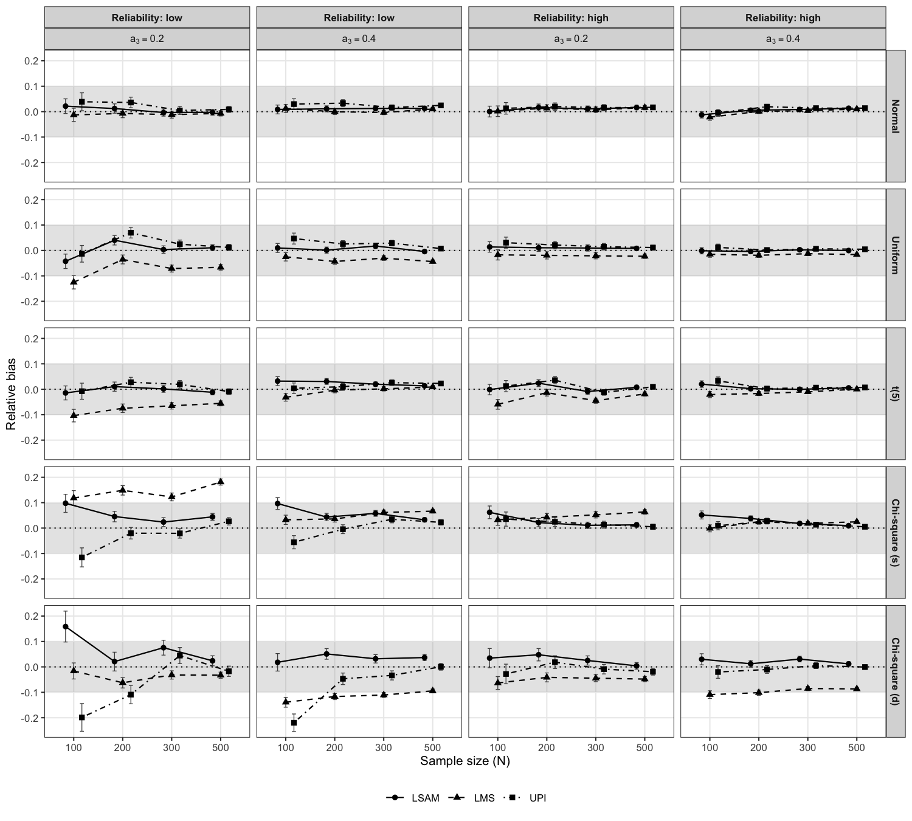
```

```{r}
#| label: fig-baseline-bias-a3
#| fig-cap: "Relative Bias of the Interaction Coefficient ($a_3$) Under the 
#| Correctly Specified Condition Across Sample Sizes, Reliability, Interaction 
#| Values, and Distributions"
#| apa-note: "The gray band marks the acceptable region for the measure, and the error bars represent the Monte Carlo standard error (MCSE). LSAM = local structural-after-measurement; LMS = latent moderated structural equations; UPI = unconstrained product indicator."
#| out-width: "100%"
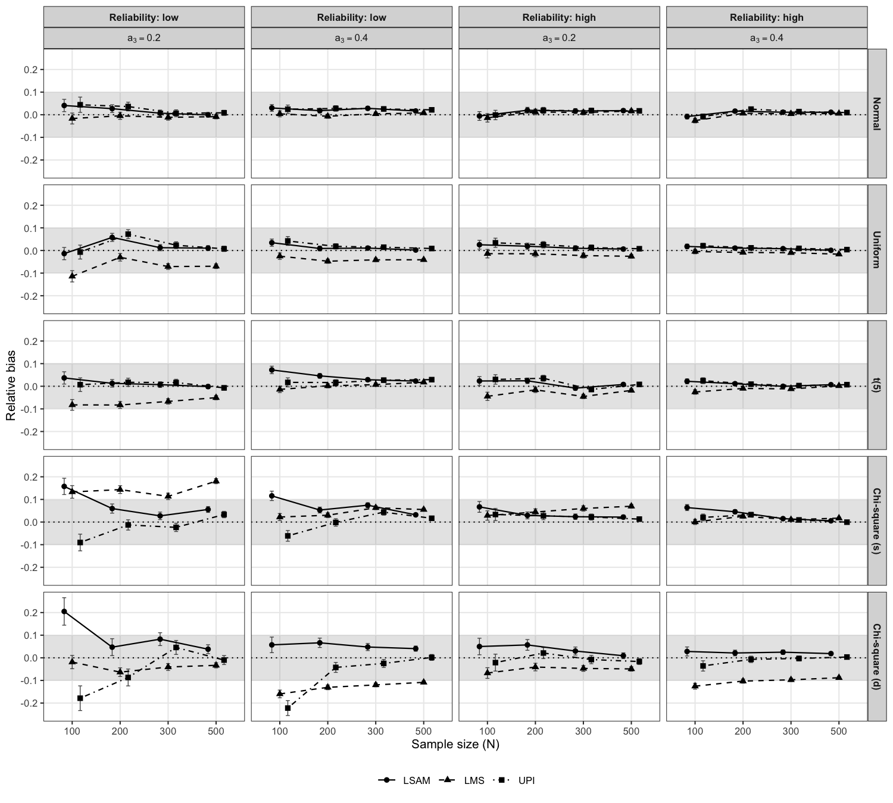
```

```{r}
#| label: fig-bias
#| fig-cap: "Relative Bias of the imm ($a_3 b$) and the Interaction Coefficient 
#| ($a_3$) Across Distributions, Reliability, and (Mis)specifications for 
#| $N = 200$ and $500$ at $a_3 = 0.2$"
#| apa-note: "The gray band marks the acceptable region for relative bias. Monte Carlo standard errors (MCSEs) are not shown. imm = index of moderated mediation; LSAM = local structural-after-measurement; LMS = latent moderated structural equations; UPI = unconstrained product indicator; n = no misspecification."
#| out-width: "6.3in"
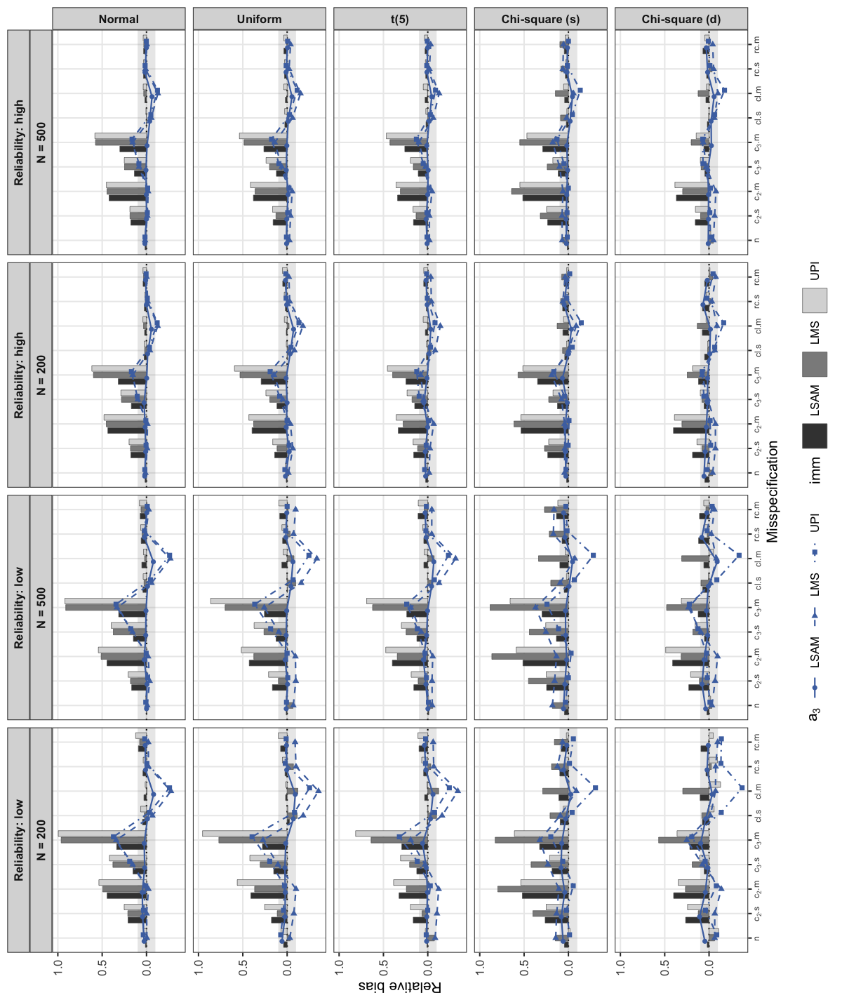
```

```{r}
#| label: fig-rmse
#| fig-cap: "Relative RMSE of the imm ($a_3 b$) and the Interaction Coefficient 
#| ($a_3$) Across Distributions, Reliability, and (Mis)specifications for 
#| $N = 200$ and $500$ at $a_3 = 0.2$"
#| apa-note: "The error bars represent the Monte Carlo standard error (MCSE). No acceptable region is defined for this measure. imm = index of moderated mediation; LSAM = local structural-after-measurement; LMS = latent moderated structural equations; UPI = unconstrained product indicator; n = no misspecification."
#| out-width: "100%"
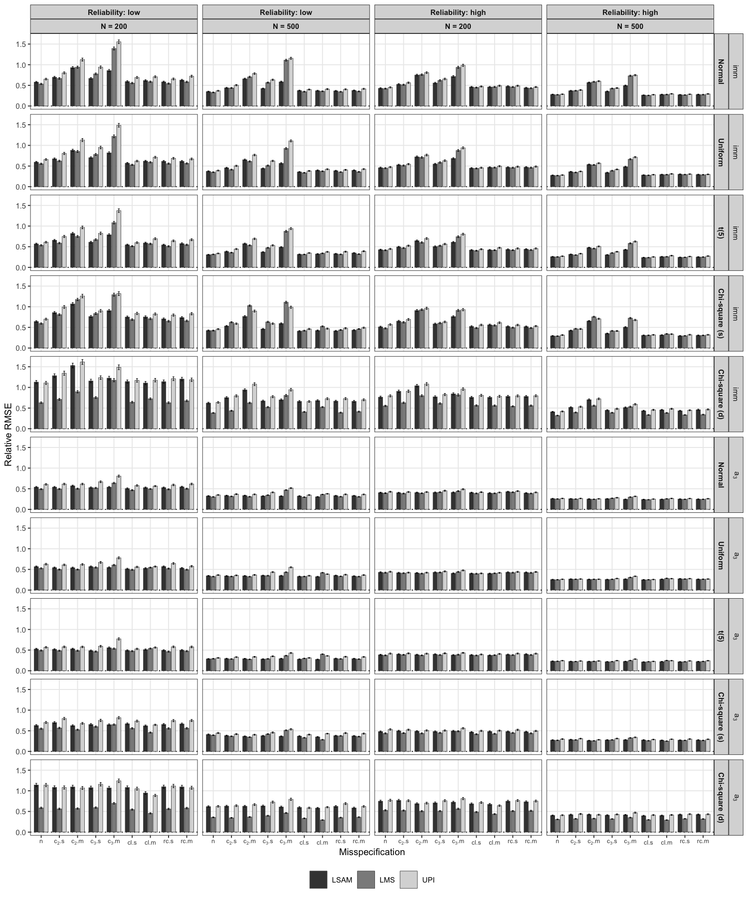
```

```{r}
#| label: fig-sesd-imm
#| fig-cap: "SE/SD of the imm ($a_3 b$) Across Distributions, Reliability, and 
#| (Mis)specifications for $N = 200$ and $500$ at $a_3 = 0.2$"
#| apa-note: "The gray band marks the acceptable region for the measure. The Monte Carlo standard error (MCSE) is not computed for the SE/SD ratio. imm = index of moderated mediation; LSAM = local structural-after-measurement; LMS = latent moderated structural equations; UPI = unconstrained product indicator; n = no misspecification."
#| out-width: "6.3in"
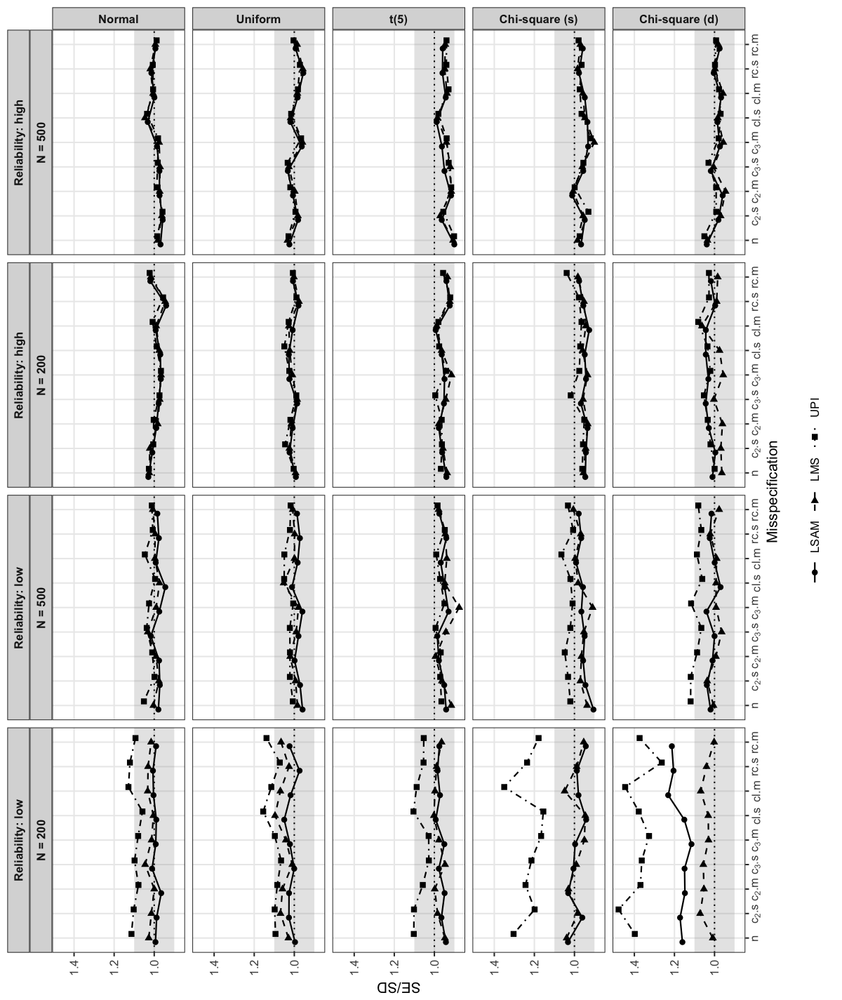
```

```{r}
#| label: fig-sesd-a3
#| fig-cap: "SE/SD of the Interaction Coefficient ($a_3$) Across Distributions, 
#| Reliability, and (Mis)specifications for $N = 200$ and $500$ at $a_3 = 0.2$"
#| apa-note: "The gray band marks the acceptable region for the measure. The Monte Carlo standard error (MCSE) is not computed for the SE/SD ratio. LSAM = local structural-after-measurement; LMS = latent moderated structural equations; UPI = unconstrained product indicator; n = no misspecification."
#| out-width: "6.3in"
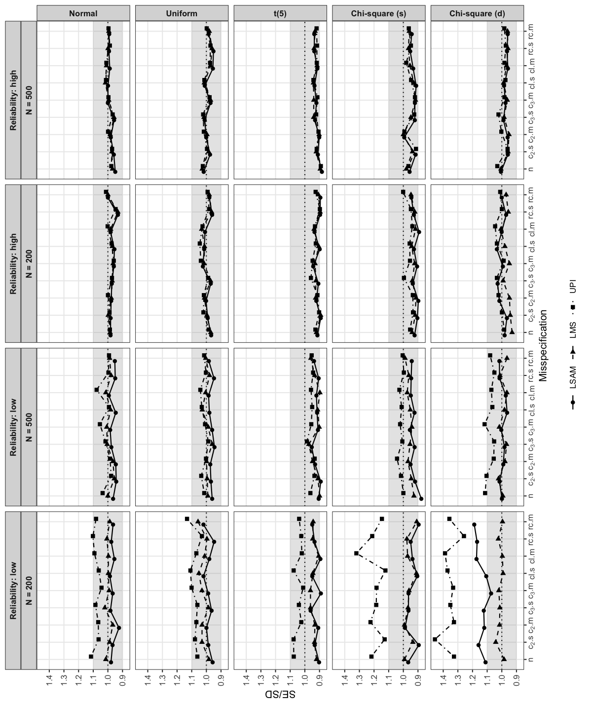
```

```{r}
#| label: fig-coverage-imm
#| fig-cap: "Coverage of the imm ($a_3 b$) Across Distributions, Reliability, 
#| and (Mis)specifications for $N = 200$ and $500$ at $a_3 = 0.2$"
#| apa-note: "The gray band marks the acceptable region for the measure, and the error bars represent the Monte Carlo standard error (MCSE). imm = index of moderated mediation; LSAM = local structural-after-measurement; LMS = latent moderated structural equations; UPI = unconstrained product indicator; n = no misspecification."
#| out-width: "6.3in"
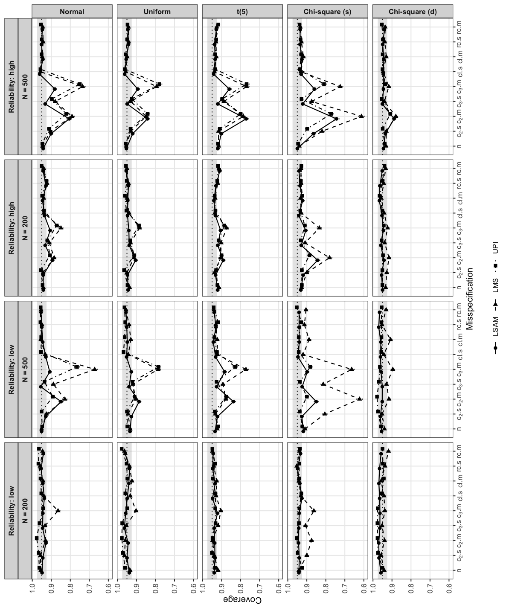
```

```{r}
#| label: fig-coverage-a3
#| fig-cap: "Coverage of the Interaction Coefficient ($a_3$) Across Distributions, 
#| Reliability, and (Mis)specifications for $N = 200$ and $500$ at $a_3 = 0.2$"
#| apa-note: "The gray band marks the acceptable region for the measure, and the error bars represent the Monte Carlo standard error (MCSE). LSAM = local structural-after-measurement; LMS = latent moderated structural equations; UPI = unconstrained product indicator; n = no misspecification."
#| out-width: "6.3in"
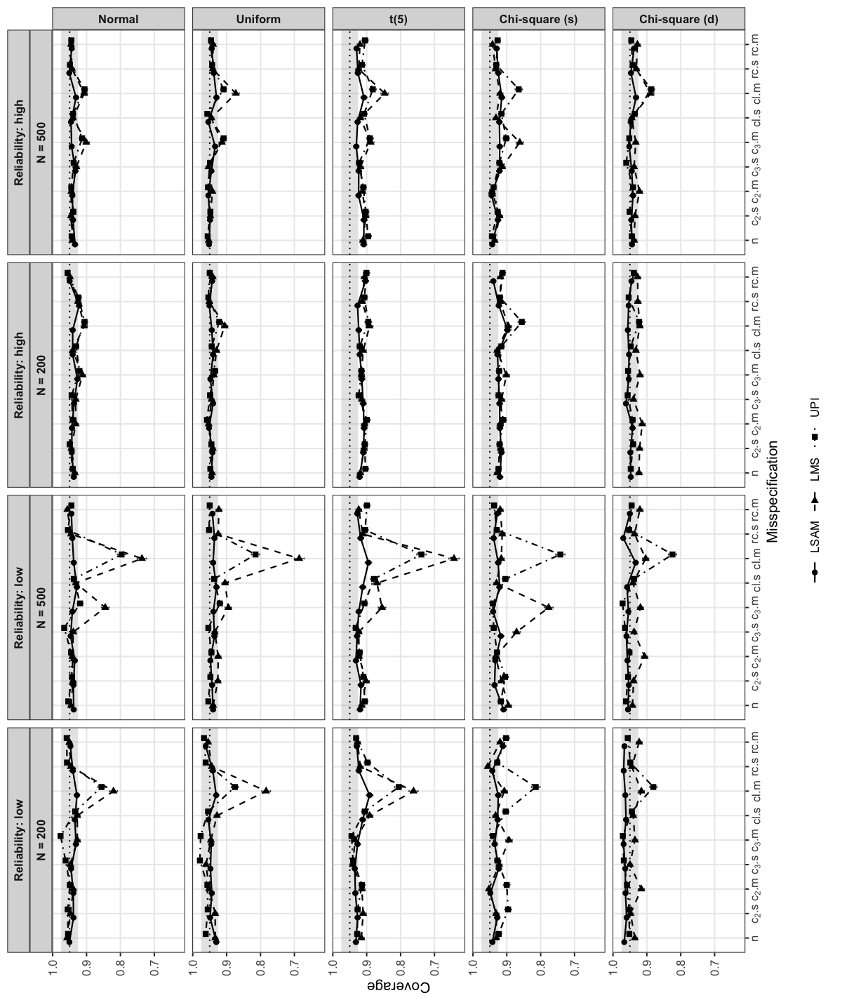
```

```{r}
#| label: fig-typei
#| fig-cap: "Type I Error of the imm ($a_3 b$) and the Interaction Coefficient 
#| ($a_3$) Across Distributions, Reliability, and (Mis)specifications for 
#| $N = 200$ and $500$ at $a_3 = 0$"
#| apa-note: "The gray band marks the acceptable region for the measure, and the error bars represent the Monte Carlo standard error (MCSE). imm = index of moderated mediation; LSAM = local structural-after-measurement; LMS = latent moderated structural equations; UPI = unconstrained product indicator; n = no misspecification."
#| out-width: "100%"
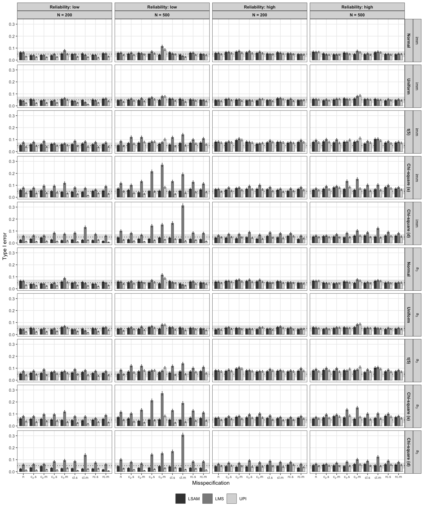
```

```{r}
#| label: fig-power
#| fig-cap: "Power for the imm ($a_3 b$) and the Interaction Coefficient ($a_3$) 
#| Across Distributions, Reliability, and (Mis)specifications for $N = 200$ and 
#| $500$ at $a_3 = 0.2$"
#| apa-note: "The error bars represent the Monte Carlo standard error (MCSE). No acceptable region is defined for this measure. imm = index of moderated mediation; LSAM = local structural-after-measurement; LMS = latent moderated structural equations; UPI = unconstrained product indicator; n = no misspecification."
#| out-width: "100%"
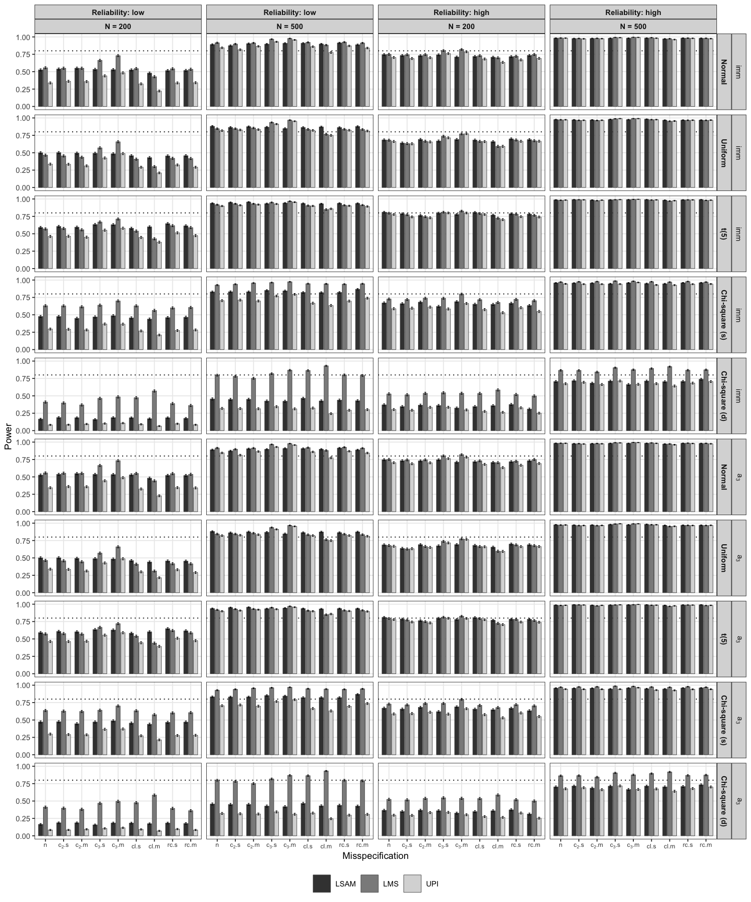
```

```{r}
#| label: fig-param-bias
#| fig-cap: "Relative Bias of the Structural Coefficients 
#| ($a_1$, $a_2$, $b$, $c'$) Across Distributions and (Mis)specifications at 
#| High Reliability, $N = 500$, and $a_3 = 0.2$"
#| apa-note: "The gray band marks the acceptable region for the measure, and the error bars represent the Monte Carlo standard error (MCSE). LSAM = local structural-after-measurement; LMS = latent moderated structural equations; UPI = unconstrained product indicator; n = no misspecification."
#| out-width: "6.3in"
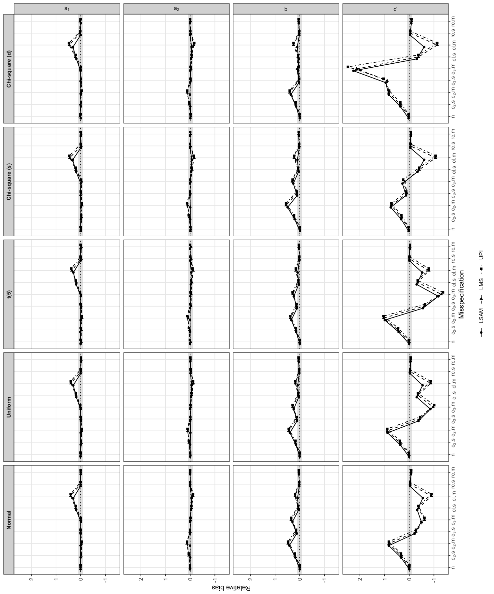
```

```{r}
#| label: fig-param-coverage
#| fig-cap: "Coverage of the Structural Coefficients ($a_1$, $a_2$, $b$, $c'$)
#| Across Distributions and (Mis)specifications at High Reliability, $N = 500$, 
#| and $a_3 = 0.2$"
#| apa-note: "The gray band marks the acceptable region for the measure, and the error bars represent the Monte Carlo standard error (MCSE). LSAM = local structural-after-measurement; LMS = latent moderated structural equations; UPI = unconstrained product indicator; n = no misspecification."
#| out-width: "6.3in"
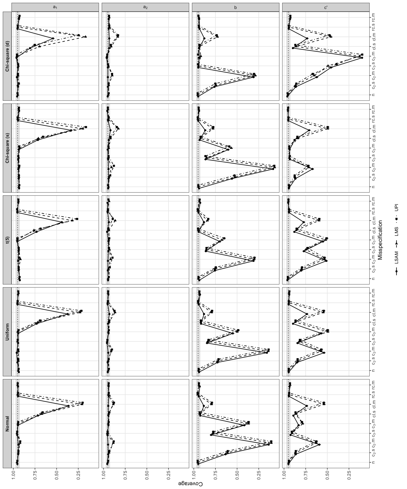
```

```{r}
#| label: fig-param-sesd
#| fig-cap: "SE/SD of the Structural Coefficients ($a_1$, $a_2$, $b$, $c'$) 
#| Across Distributions and (Mis)specifications at High Reliability, $N = 500$, 
#| and $a_3 = 0.2$"
#| apa-note: "The gray band marks the acceptable region for the measure. The Monte Carlo standard error (MCSE) is not computed for the SE/SD ratio. LSAM = local structural-after-measurement; LMS = latent moderated structural equations; UPI = unconstrained product indicator; n = no misspecification."
#| out-width: "6.3in"
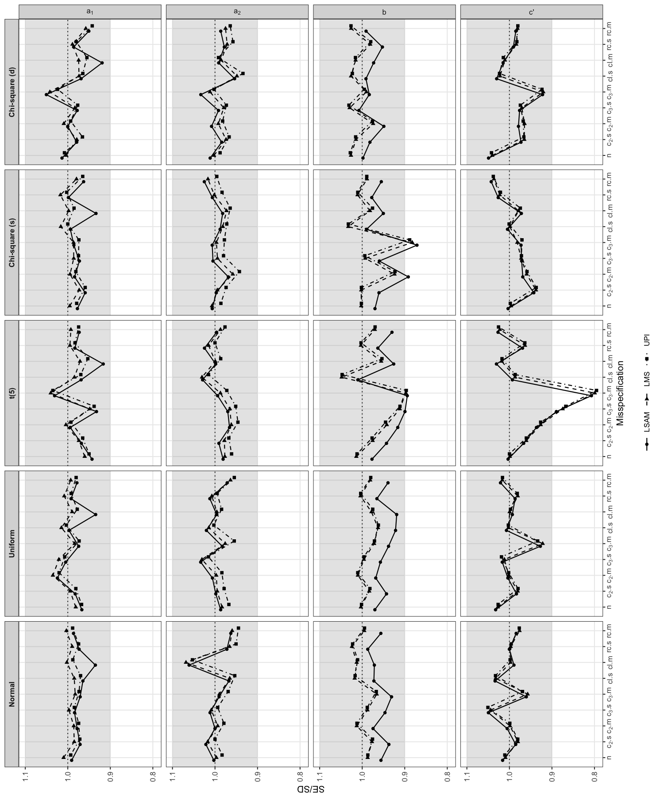
```

## Measurement Loadings

For the twelve freely estimated factor loadings, all but one are recovered 
with acceptable performance across every measure and essentially every 
condition, the exceptions being noisy deviations of the relative bias of the 
variance estimator concentrated at $N = 100$ with low reliability. We display only the loading of the cross-loaded mediator indicator $m_3$, 
with its relative bias, coverage, SE/SD ratio, and relative bias of the 
variance estimator at high reliability and $N = 500$ (@fig-load). For 
$m_3$, `cl` is the only consequential misspecification. Its relative bias 
rises sharply under all approaches, less so under LSAM, and its coverage 
collapses toward zero. The two standard error measures stay within the 
acceptable range, except for LSAM under the medium `cl` with $t_5$ and 
$\chi^2$ predictors. The remaining omissions leave the loading unaffected.

```{r}
#| label: fig-load
#| fig-cap: "Performance of the Cross-Loaded Mediator Indicator Loading ($m_3$) Across All Measures, Distributions, and (Mis)specifications at High Reliability, $N = 500$, and $a_3 = 0.2$"
#| apa-note: "The gray band in each panel marks the acceptable region for that measure. LSAM = local structural-after-measurement; LMS = latent moderated structural equations; UPI = unconstrained product indicator; n = no misspecification."
#| out-width: "100%"
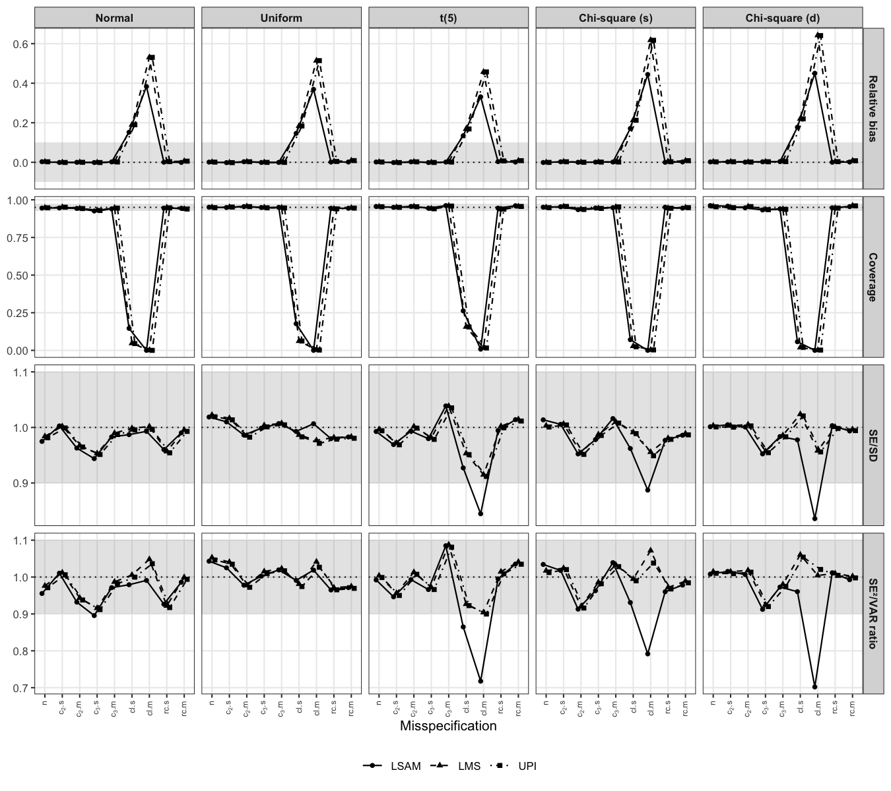
```

# Discussion

We evaluated three estimation approaches in the context of a latent variable 
moderated mediation model, the two-step LSAM and the system-wide LMS and UPI, 
under correct specification and under a large number of structural and 
measurement misspecifications as well as distributional violations. 

Under correct specification with normal predictors, all three recovered the 
imm and the interaction coefficient without bias and with nominal coverage, 
differing mainly in the SE/SD ratio, Type I error, relative RMSE, and 
power. LMS had the lowest relative RMSE and 
the highest power but, under nonnormal predictors, showed bias under 
$\chi^2$ predictors at low reliability together with below-nominal coverage 
and inflated Type I error. LSAM yielded Type I error closest to nominal, at 
the cost of a higher relative RMSE and lower power in some cases, while UPI 
fell in between, unbiased except at the smallest sample size with low 
reliability, where it was also the least stable. Both standard error 
measures stayed near one at high reliability but not at low reliability and 
small samples, where UPI overestimated standard errors, and UPI and LSAM 
struggled most under opposite-skewness $\chi^2$ predictors.

Under misspecification, LSAM was the more robust approach. The structural 
omissions in the outcome equation ($c_2$, $c_3$) biased the outcome-side 
coefficients for all approaches but left the mediator equation, and hence 
the interaction coefficient, unaffected under LSAM, whereas the system-wide 
approaches also carried them into the mediator equation, biasing $a_2$ under 
$c_2$ and the interaction coefficient under $c_3$. The cross-loading (`cl`) 
was the most damaging throughout. Under the system-wide approaches it biased 
the interaction coefficient and most structural coefficients and sharply 
lowered coverage at low reliability, while under LSAM it affected only $a_1$ 
and $c'$ and left the coverage of the interaction coefficient near nominal. 
The residual covariance (`rc`) had little effect. Where bias was substantial, 
it was smaller under LSAM, except for $c'$ under the structural omissions, 
where the three were similar, and it increased with the magnitude of the omission and at lower 
reliability.

Regarding the imm, the Monte Carlo method delivered standard errors and 
confidence intervals that behaved like those of the interaction coefficient, 
with the deviations at low reliability and small samples reflecting the 
standard errors of the underlying estimates. Under misspecification its coverage dropped with the bias of its constituents despite wider intervals. The method thus appears an adequate and far cheaper 
alternative to the bootstrap here, although a direct comparison remains to be 
made.

These patterns are broadly consistent with previous research. The behavior 
of LMS and UPI under nonnormality and their stability under normality 
reproduce earlier findings [@Brandt2014; @Cham2012; @Lonati2025; @Vieira2026], 
as does that of LSAM [@Rosseel2025; @Vieira2026]. The measurement 
misspecification results align with @Brandt2020, where an omitted 
cross-loading was likewise damaging and biased UPI, whereas the two-stage 
method of moments on which LSAM builds attained the smallest RMSE. 
@NavarroSchermelleh2025 likewise found the latent interaction effect 
underestimated under omitted cross-loadings with LMS, which they trace to 
the biased predictor covariance entering the variance of the interaction 
term. Even so, @Brandt2020 found no approach free of bias and none uniformly 
best, as we also observed. Lastly, the contrast between the structural and 
the measurement omissions matches the expectation of @Robitzsch2022 that 
the advantage of SAM lies in structural rather than measurement 
misspecification, since the cross-loading biased LSAM as well, whereas the 
structural omissions left its mediator equation untouched.

Finally, although we evaluated the estimation approaches from a statistical 
perspective, the moderated mediation model itself rests on strong causal 
assumptions [@Imai2010; @Rohrer2022]. Good statistical performance in certain 
conditions is therefore not, on its own, a justification for a causal claim, 
and we direct interested readers to the developing literature on the causal 
interpretation of mediation [@Morelli2026; @Imai2010]. Moreover, 
misspecification had strong consequences across all three approaches, and 
many of the omissions studied may be highly plausible in applied contexts.



# References

::: {#refs}
:::



# Calibration and Data Generation {#apx-calibration}

This appendix gives the formulas behind the data-generating mechanism. The 
calibration that fixes the variance parameters comes first, followed by the 
three-stage data generation that uses them.

## Calibration

The structural disturbance variances and indicator error variances were fixed by
the following closed-form calibration, computed once under the normal baseline.

### Structural residual variances

The disturbance variances $\psi_M, \psi_Y$ are fixed so that each structural
equation explains a fraction $R^2 \approx 0.30$ of its outcome's variance at the
central interaction level $a_3 = 0.2$ under the normal baseline. Writing the
systematic part of $M$ as $S_M = a_1 X + a_2 W + a_3 (X W)$, its variance needs
only second moments,

$$
\operatorname{Var}(S_M) = a_1^2 + a_2^2 + 2 a_1 a_2 \rho + a_3^2 (1 + \rho^2),
$$

\noindent and the disturbance is the remainder that brings the signal share to $R^2$,

$$
\psi_M = \operatorname{Var}(S_M)\,\frac{1 - R^2}{R^2}, \qquad
\psi_Y = \operatorname{Var}(b M + c' X)\,\frac{1 - R^2}{R^2},
$$

\noindent with $\operatorname{Var}(b M + c' X) = b^2 \operatorname{Var}(M) + c'^2 + 2 b c'\,(a_1 + a_2 \rho)$.
Fixed at these values, the population variances of $M$ and $Y$ are closed-form
functions of the parameters,

$$
\operatorname{Var}(M) = \operatorname{Var}(S_M) + \psi_M, \qquad
\operatorname{Var}(Y) = b^2 \operatorname{Var}(M) + c'^2 + 2 b c'\,(a_1 + a_2 \rho) + \psi_Y,
$$

\noindent evaluated once under the normal baseline and held fixed across distributions, so
that $R^2$ and reliability drift only through the design factors.

### Indicator reliabilities

To hit a target reliability $\omega \in \{0.5, 0.7\}$, the error variance of
indicator $j$ is set from the latent variance $V = \operatorname{Var}(\eta)$,

$$
\theta_{\eta j} = \lambda_j^2\, V\,\frac{1 - \omega}{\omega}.
$$

For $X, W$ the variance is exactly $1$; for $M, Y$ it is the closed form above,
fixed at the normal baseline, so the realized reliability drifts mildly across
distributions.

### Calibrating the misspecification magnitudes

The *small* and *medium* labels are standardized coefficients, $t \in \{0.25, 0.50\}$.
For an omitted predictor $p$ added to a baseline outcome $y_0$, the
magnitude is the fully standardized regression coefficient of $p$,

$$
t = \frac{\beta\,\operatorname{sd}(p)}{\operatorname{sd}(y_0 + \beta p)}.
$$

Squaring and substituting $\operatorname{Var}(y_0 + \beta p) = \operatorname{Var}(y_0) + \beta^2 \operatorname{Var}(p) + 2 \beta \operatorname{Cov}(p, y_0)$
yields a quadratic $A\beta^2 + B\beta + C = 0$ with

$$
A = \operatorname{Var}(p)\,(1 - t^2), \quad
B = -2 t^2 \operatorname{Cov}(p, y_0), \quad
C = -t^2 \operatorname{Var}(y_0).
$$

Since $A > 0$ and $C < 0$ the roots have opposite sign; the positive omitted path
is the positive root,

$$
\beta = \frac{t^2 \operatorname{Cov}(p, y_0) + \sqrt{\,t^4 \operatorname{Cov}(p, y_0)^2 + t^2 (1 - t^2)\,\operatorname{Var}(p)\,\operatorname{Var}(y_0)\,}}{\operatorname{Var}(p)\,(1 - t^2)}.
$$

The three moments are estimated from one large ($n = 10^6$) sample per
distribution and $a_3$ level. The predictor $p$ and baseline $y_0$ differ by
misspecification,

$$
\begin{aligned}
c_2: \quad & p = W,   && y_0 = b M + c' X + \zeta_Y, \\
c_3: \quad & p = X W, && y_0 = b M + c' X + \zeta_Y, \\
\texttt{cl}: \quad & p = X,   && y_0 = m_3 = \lambda_3 M + \delta_{m_3}.
\end{aligned}
$$

$c_2$ and $c_3$ are reliability independent; `cl` depends on $\omega$ because its
baseline $m_3$ carries measurement noise. `rc` never enters the calibration: it
is a residual correlation and equals its target in every cell.

### Holding $Y$ reliability fixed under $c_2$ and $c_3$

Adding an omitted structural path inflates $\operatorname{Var}(Y)$ by
$\kappa = \operatorname{Var}(y_0 + \beta p) / \operatorname{Var}(y_0)$, which would
raise $Y$'s indicator reliability as a side effect. Scaling the $Y$-indicator
noise by the same $\kappa$ makes signal and noise move together, so $\kappa$
cancels and the reliability returns to its no-misspecification value,

$$
\omega_j = \frac{\kappa\,\lambda_j^2 V}{\kappa\,\lambda_j^2 V + \kappa\,\theta_j}
= \frac{\lambda_j^2 V}{\lambda_j^2 V + \theta_j}.
$$

The latent effect size is untouched; only the $Y$ indicators are made
correspondingly noisier. The measurement level misspecifications `cl` and `rc`
act on the indicators directly and are not compensated, since that contamination
is itself the misspecification.

## Data generation

Using the calibrated variances above, data were generated in three stages: the
correlated exogenous predictors, the dependent latent variables through the
structural model, and the observed indicators through the measurement model.

### Stage I: Exogenous predictors

The correlated predictors $(X, W)$ were generated with the vine-to-anything
(VITA) method [@Gronneberg2022], as implemented in the *covsim*
package, with sampling via *rvinecopulib* [@Nagler2025]. They were specified to
have mean $0$, variance $1$, and the covariance structure

$$
\Phi = \begin{bmatrix} 1 & \rho \\ \rho & 1 \end{bmatrix}
     = \begin{bmatrix} 1 & 0.3 \\ 0.3 & 1 \end{bmatrix},
$$

\noindent so that the conditions differ only in distributional shape. Under the normal
condition, the predictors had Gaussian marginals with the specified covariance
structure. Under the uniform condition, they had symmetric uniform marginals
$\mathrm{U}(-\sqrt3, \sqrt3)$, which have mean $0$ and variance $1$. Under the
$t_5$ condition, they had Student $t$ marginals with five degrees of freedom,
rescaled by $\sqrt{5/3}$ to unit variance. The two $\chi^2$ conditions used
$\chi^2_2$ marginals, centered by their mean ($2$) and scaled by their standard
deviation ($2$) to mean $0$ and variance $1$. In the same-direction condition
both predictors are right-skewed, whereas in the opposite-direction condition
$W$ is negated so that $X$ and $W$ are skewed in opposite directions, with the
sampled correlation sign flipped to restore $\operatorname{Cor}(X, W) = \rho$. In
every condition, VITA constructed a vine copula to impose $\Phi$ while preserving
the marginals. 

### Stage II: Structural model

The dependent latent variables were generated from the structural equations

$$
M = a_1 X + a_2 W + a_3 (X \times W) + \zeta_M, \qquad
Y = b M + c' X + \zeta_Y,
$$

\noindent with independent Gaussian disturbances $\zeta_M \sim \mathcal{N}(0, \psi_M)$ and
$\zeta_Y \sim \mathcal{N}(0, \psi_Y)$. The disturbance variances $\psi_M, \psi_Y$
take the calibrated values so that each equation explains $R^2 \approx 0.30$ of
its outcome's variance at the central interaction level under the normal baseline.

### Stage III: Measurement model

Each latent $\eta \in \{X, W, M, Y\}$ was measured by four indicators,

$$
z_{\eta j} = \lambda_j\,\eta + \delta_{\eta j}, \qquad \lambda = (1, 0.8, 0.7, 0.6),
$$

\noindent with independent Gaussian errors $\delta_{\eta j} \sim \mathcal{N}(0, \theta_{\eta j})$.
The error variances $\theta_{\eta j}$ take the calibrated values that achieve the
target reliability $\omega \in \{0.5, 0.7\}$. Only the exogenous predictors varied
in distribution. The structural disturbances and measurement errors were Gaussian
in every condition.
